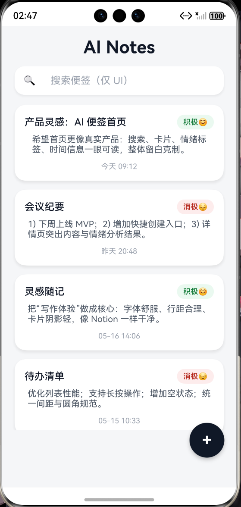
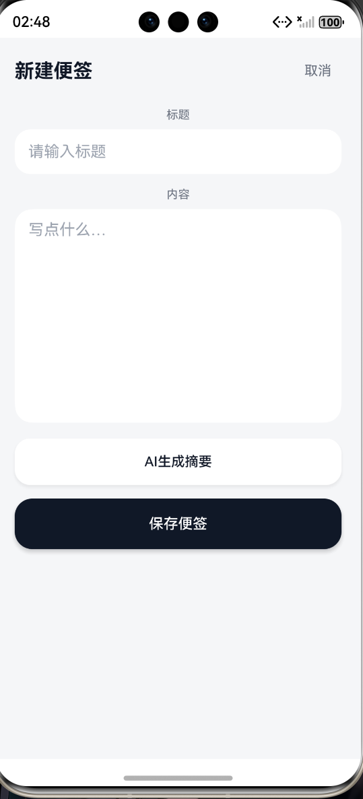

# 🚀 HarmonyOS AI Notes

> 基于 HarmonyOS NEXT + ArkTS + Laravel 构建的 AI 智能便签应用

一个融合 AI 摘要生成、情绪分析、本地存储与 HarmonyOS 工程化开发的智能便签项目。

---

# 📖 项目简介

HarmonyOS AI Notes 是一个基于 HarmonyOS NEXT 开发的 AI 增强型便签应用。

用户不仅可以完成普通便签的新增、删除、本地存储等操作，还可以通过 AI 自动生成摘要与情绪分析，实现更加智能化的记录体验。

本项目主要用于：

- HarmonyOS NEXT 学习实践
- ArkTS 工程化开发
- AI 接口调用演练
- 前后端联调实践
- Git Flow 协作流程学习

---

# ✨ 项目特色

✅ HarmonyOS NEXT 原生开发  
✅ ArkTS 页面与状态管理  
✅ AI 摘要生成  
✅ AI 情绪分析  
✅ 本地数据持久化  
✅ Service 层封装  
✅ 网络请求封装  
✅ Git Flow 分支管理  
✅ HarmonyOS 与 Laravel 前后端联调  

---

# 🛠 技术栈

## HarmonyOS

- HarmonyOS NEXT
- ArkTS
- ArkUI
- @ohos.net.http
- Preferences 本地存储
- Router 页面跳转

## 后端

- Laravel
- RESTful API
- JSON 数据返回
- Mock AI 接口

## 工程化

- Git
- Git Flow
- Service 层设计
- Utils 工具类封装

---

# 📂 项目结构

```bash
entry/src/main/ets
│
├── pages
│   ├── Index.ets
│   └── CreateNote.ets
│
├── model
│   └── NoteModel.ets
│
├── service
│   ├── AiService.ets
│   └── StorageService.ets
│
├── utils
│   └── HttpUtil.ets
│
└── components
```

---

# 📱 功能模块

## 🏠 首页

- 便签列表展示
- 情绪标签展示
- 空状态展示
- 悬浮新增按钮
- 页面自动刷新

---

## ✍️ 新建便签

- 标题输入
- 内容输入
- AI 自动摘要
- AI 情绪分析
- 本地保存

---

## 🤖 AI 功能

### AI 摘要生成

用户输入内容后：

- 调用 Laravel AI 接口
- 自动生成标题摘要
- 自动更新标题输入框

示例：

输入：

```text
今天学习了 HarmonyOS 网络请求与本地存储开发。
```

输出：

```text
HarmonyOS开发学习总结
```

---

### AI 情绪分析

根据用户输入内容：

自动识别当前情绪：

- 😊 positive
- 😔 negative

并动态展示不同状态。

---

# 🌐 AI 接口联调

## Laravel Mock AI

接口地址：

```bash
http://10.0.2.2:8000/api/ai/summary
```

返回格式：

```json
{
  "code": 200,
  "message": "success",
  "data": {
    "summary": "HarmonyOS开发学习总结",
    "mood": "positive"
  }
}
```

---

# 📸 项目截图

## 首页



---

## 新建便签



---

## AI 摘要效果


---

# 🔀 Git Flow 演练

项目使用 Git Flow 分支管理：

```bash
main
develop
feature/day1-ui
feature/day3-ai
```

开发流程：

```bash
feature → develop → main
```

---

# 🚀 项目运行

## HarmonyOS

使用 DevEco Studio 打开项目运行。

---

## Laravel Mock AI

启动 Laravel：

```bash
php artisan serve --host=0.0.0.0 --port=8000
```

---

# 📅 开发记录

## Day1

- HarmonyOS 项目初始化
- 首页 UI 开发
- 新建页面开发
- 页面跳转实现

---

## Day2

- 本地存储实现
- 新增删除功能
- 数据持久化
- 页面刷新逻辑

---

## Day3

- AI 摘要功能
- AI 情绪分析
- HTTP 网络请求
- Laravel Mock AI
- HarmonyOS 与 Laravel 联调

---

## Day4

- Git Flow 演练
- README 完善
- 项目截图整理
- GitHub / Gitee 发布

---

# 🧠 项目收获

通过本项目学习并实践了：

- HarmonyOS NEXT 开发
- ArkTS 页面开发
- 状态管理
- 本地存储
- HTTP 网络请求
- Laravel API 开发
- JSON 数据解析
- AI 接口联调
- Service 层封装
- Git Flow 分支管理

项目从普通便签应用：

升级为：

AI 增强型智能便签应用。

---

# 📌 后续优化方向

- 接入真实 AI 大模型
- AI 自动标签
- AI 自动分类
- Markdown 编辑器
- 云同步
- 用户系统
- 深色模式
- 多端同步

---

# ⭐ 项目目标

通过本项目逐步掌握：

- HarmonyOS NEXT 应用开发
- ArkTS 工程化开发
- 鸿蒙网络请求
- 本地存储
- AI 应用开发
- 前后端联调
- Git Flow 企业协作流程
